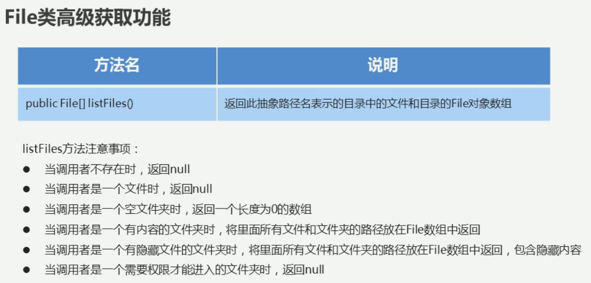
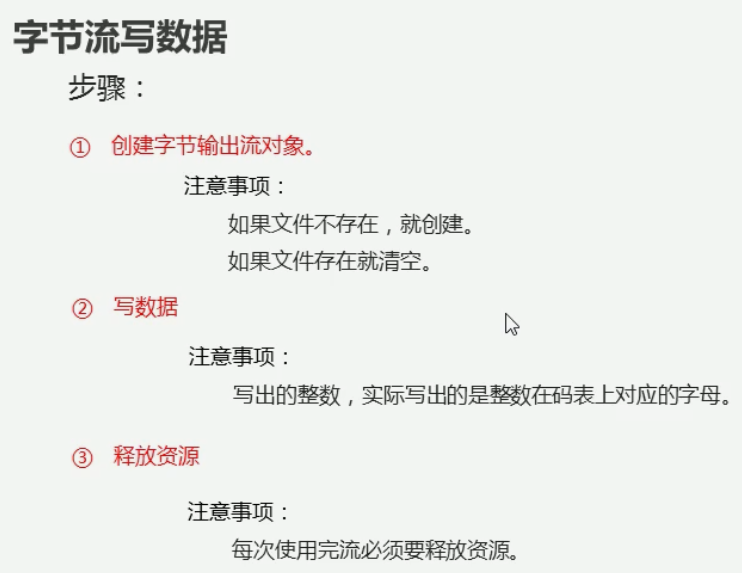
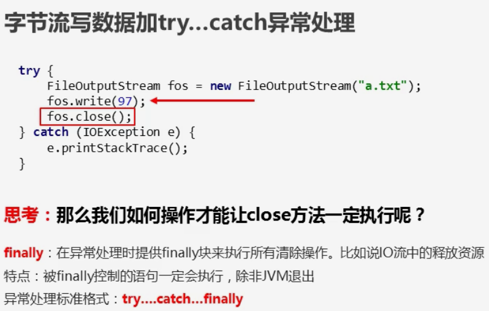
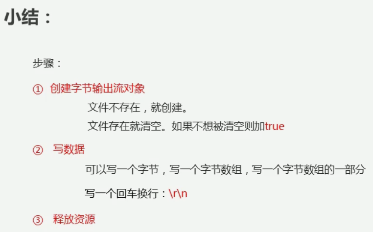
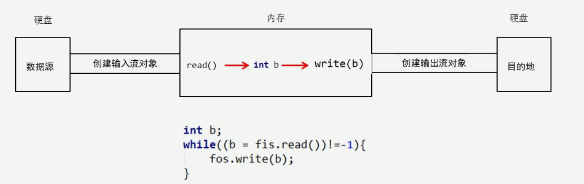
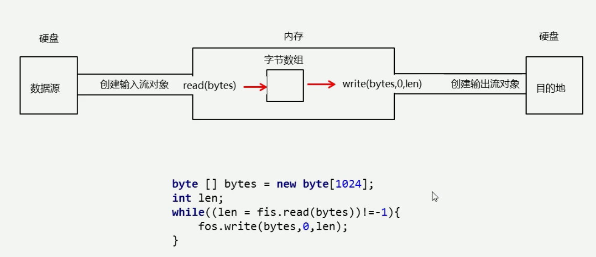
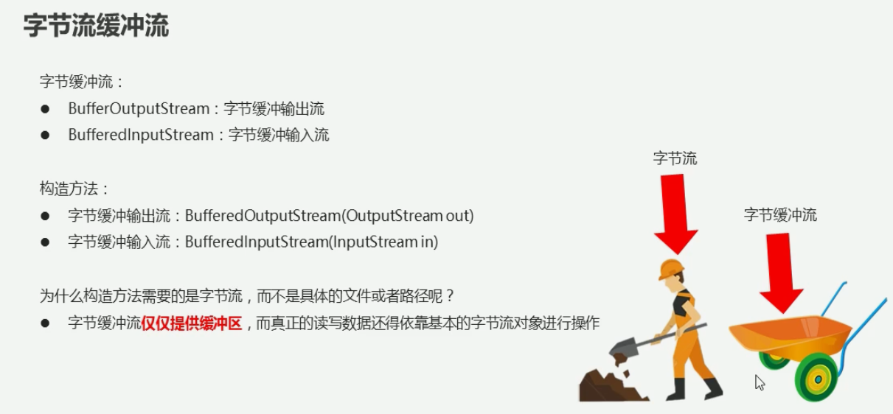
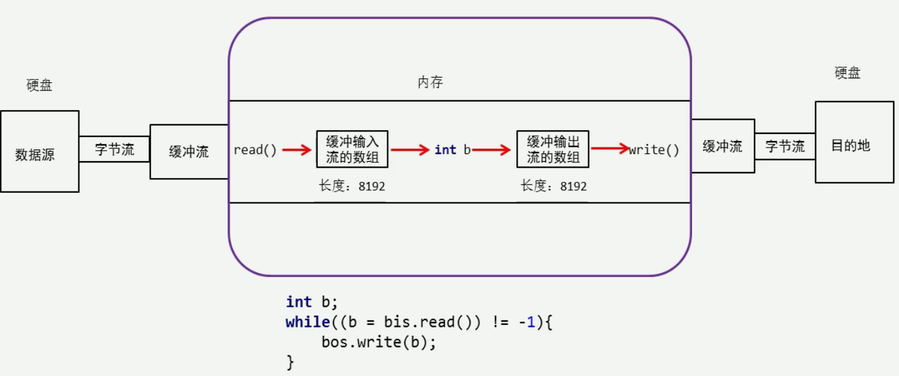
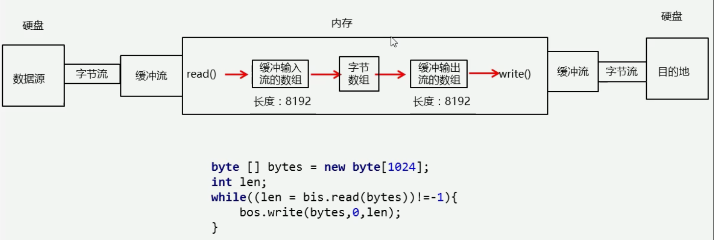

# IO流
IO用于对文件操作，而文件File类是对文件进行创建、删除，表示这个文件夹、文件在哪

## File

### file的listFile方法

## IO
IO流按数据类型划分为：
- 字符流 只能操作纯文本文件  包括java文件，txt文件
- 字节流 操作所有类型的文件  包括音频视频图片等

*字节流写文件步骤*

*代码有漏洞，可能不执行close()方法*

*字节流小结*

*字节流复制过程*

毫无疑问，一个一个地读慢，那我就多个多个地读

*提高速度*

*小数组拷贝原理*

## 字节缓冲流
继续提高读写的效率

*原理实现*
为什么快？缓冲流就是一个工具，提前把8192个字节从硬盘运到内存中，而不再是一个字节一个字节的从硬盘到内存中，后面，从内存中进行数据交换。（减少了IO操作次数，内存中运行又更快）

使用byte[]*数组优化的地方*

### 字节流小总结

## 字符流