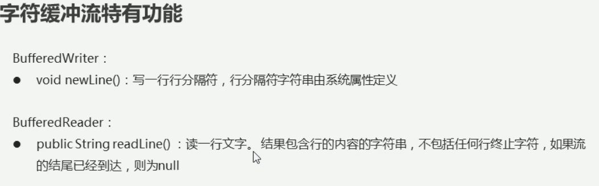
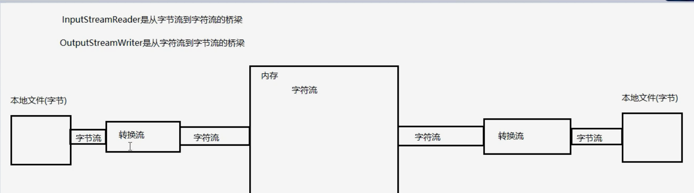
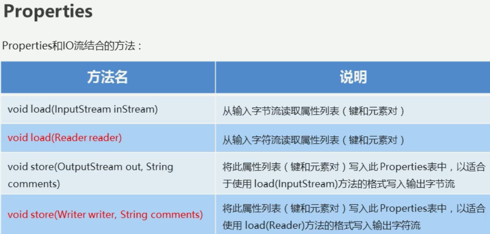

# IO流
IO用于对文件操作，而文件File类是对文件进行创建、删除，表示这个文件夹、文件在哪

## File

### file的listFile方法

## IO
IO流按数据类型划分为：
- 字符流 只能操作纯文本文件  包括java文件，txt文件
- 字节流 操作所有类型的文件  包括音频视频图片等

*字节流写文件步骤*

*代码有漏洞，可能不执行close()方法*

*字节流小结*

*字节流复制过程*

毫无疑问，一个一个地读慢，那我就多个多个地读

*提高速度*

*小数组拷贝原理*

## 字节缓冲流
继续提高读写的效率

*原理实现*
为什么快？缓冲流就是一个工具，提前把8192个字节从硬盘运到内存中，而不再是一个字节一个字节的从硬盘到内存中，后面，从内存中进行数据交换。（减少了IO操作次数，内存中运行又更快）

使用byte[]*数组优化的地方*

### 字节流小总结

## 字符流

可以解决中文乱码的问题(乱码:编码与解码不一致的问题)

*编码需要了解的地方*

因为字节流一次读一个字节，而不管UTF-8,GBK一个中文都是多个字节，用字节流只能读取其中的一部分，所以会出现乱码问题。

*读取、写入要求*

*字符流---写出数据的注意事项*

同样的，字符缓冲流可以提高读入、读出效率

*字符缓冲流特有功能*

## 转换流

*从字符流到字节流的桥梁作用*

从jdk11之后，字符流便支持指定编码格式，Charset.

## 对象操作流
特点：可以把对象以字节的形式写到本地文件，直接打开文件，是读不懂的，需要再次用对象操作流读到内存中.(保护数据安全)

*序列化*

*序列化注意事项*

### Properties
特殊的map集合

*Properties和IO流结合的方法*

trips:
- ctrl+b 查看源码
- ctrl+shift+/ 多行注释
- alt+7 查看结构
- Ctrl+n 搜索要查看的源码，然后查看