# 网络

## 三要素
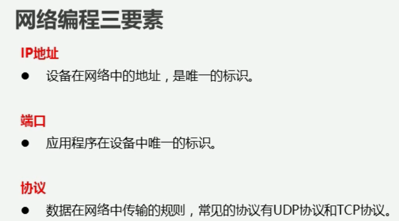

### IP(设备标识)
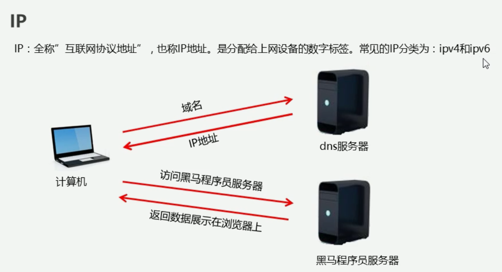

简单了解:IPV6表示法
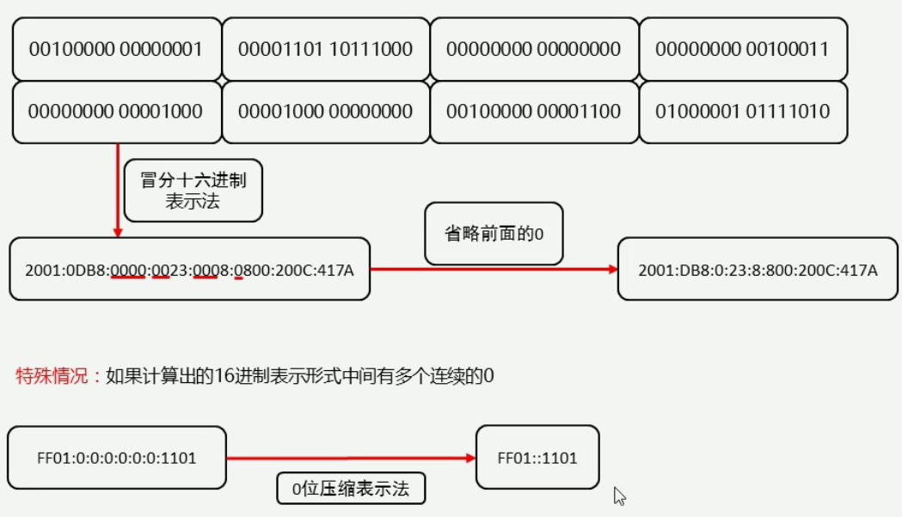

常用命令:
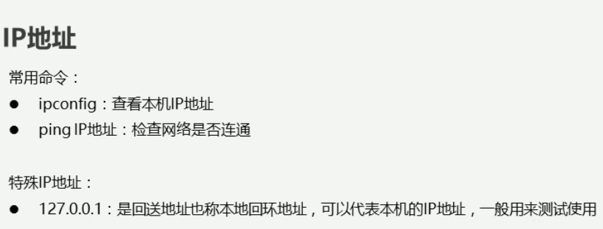

### 端口(应用标识)
端口基础知识
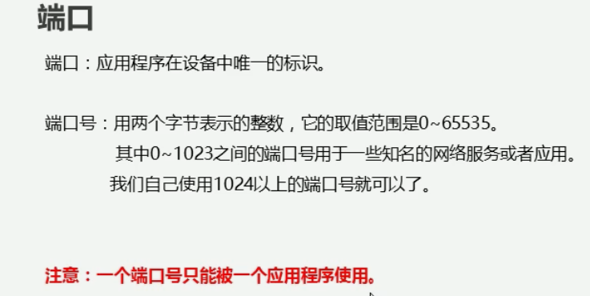

### 协议
UDP协议:面向无连接
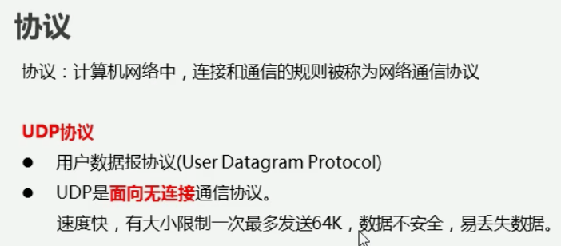

TCP协议:面向连接
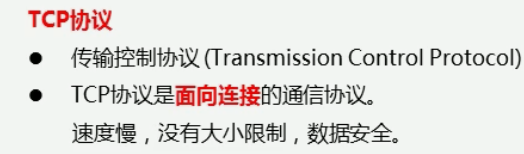

### UDP传输
服务器端接收数据:
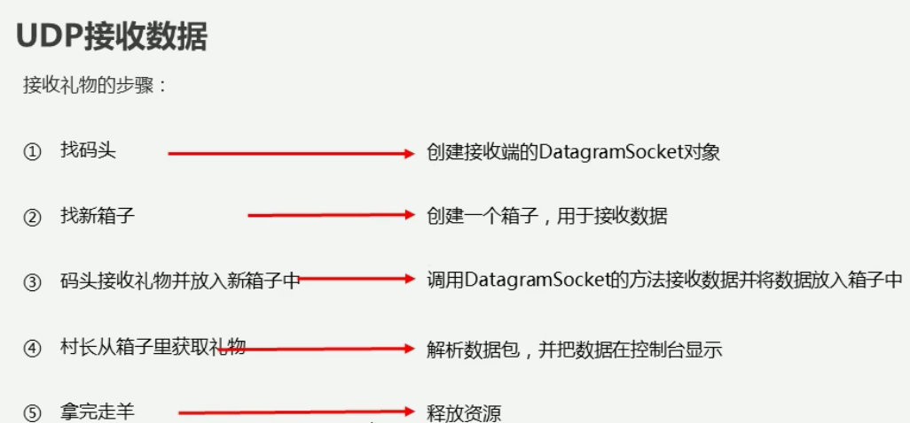

#### UDP 的三种通信方式
- 单播：1对一
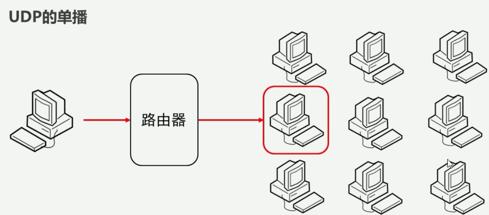 
- 组播：一对多
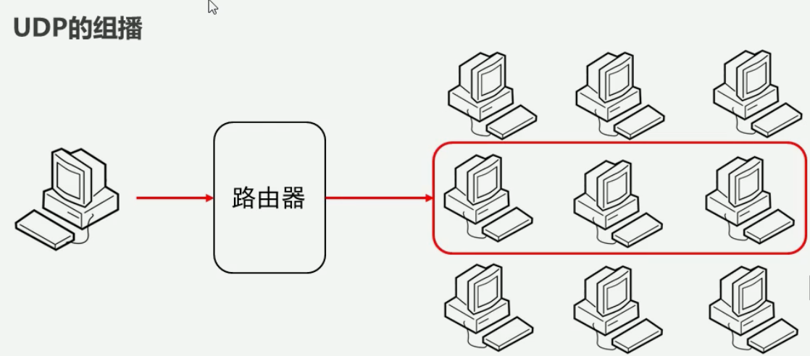
- 广播：一对所有
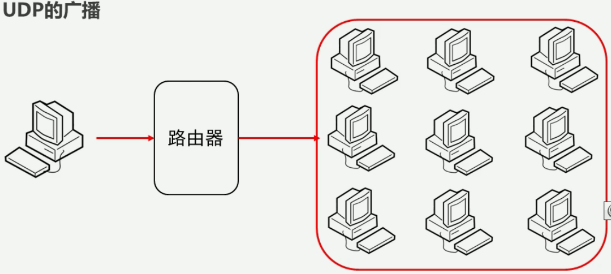
##### 组播实现
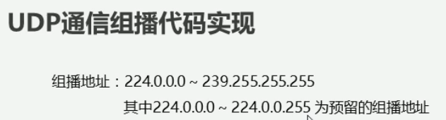
UDP组播代码实现：
- 发送端

- 接收端
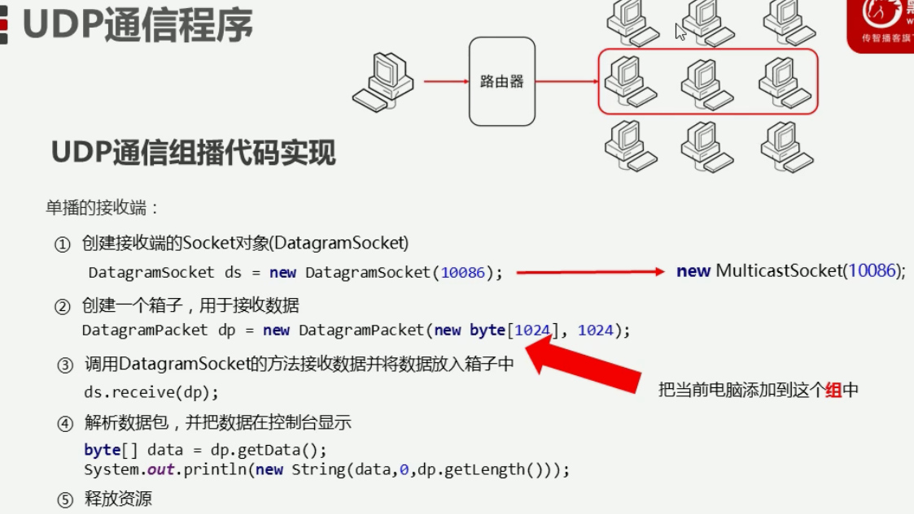

UDP广播代码实现:
- 发送端
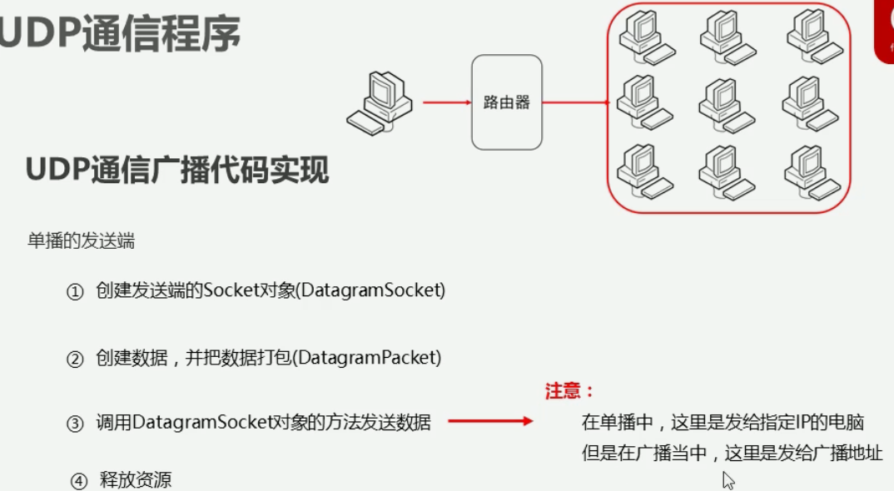
广播地址

- 接收端:与单播的接收端一样

### TCP协议
- 通信原理：
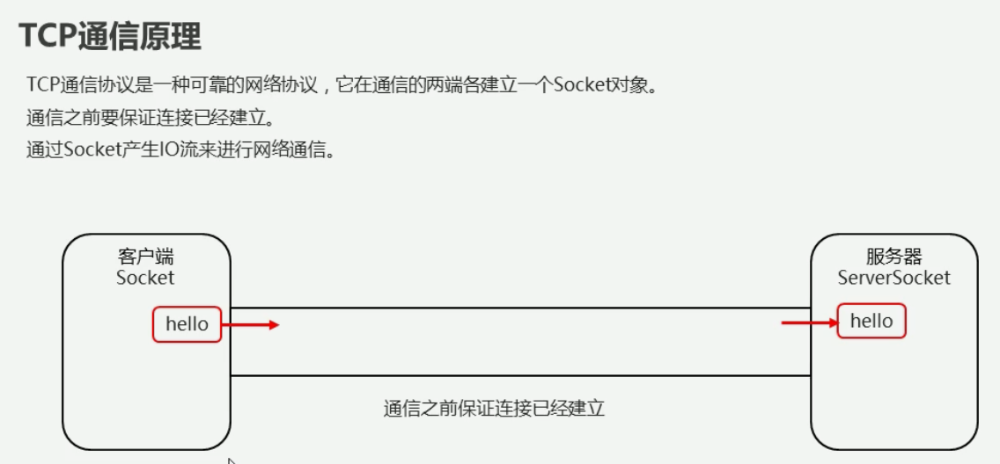
- tcp发送数据:
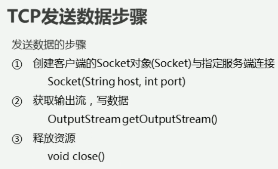
- tcp接收数据:
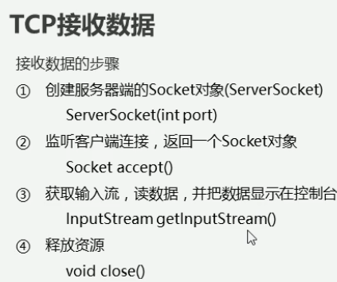

- 注意事项:
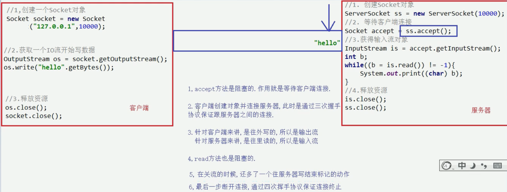

- 连接时：三次握手
- 取消连接时:四次挥手，服务器多了一个最后处理数据的过程，处理完之后才能取消连接

- 对于输入输出的判断：
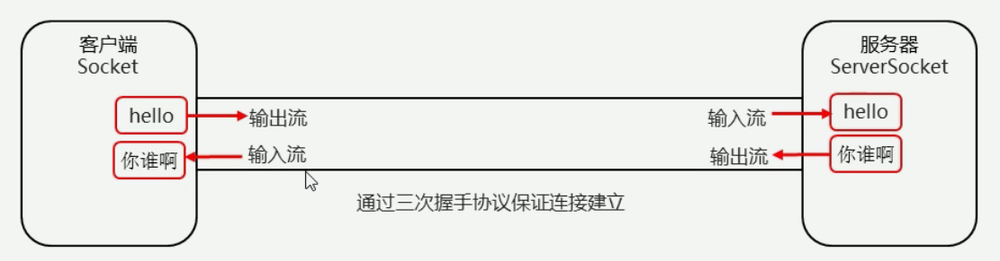

- UUID类:生成随机且唯一的通用标识符的类
UUID.randomUUID()方法生成随机的文件名

TCP 网络传输优化分析:
- 使用多线程
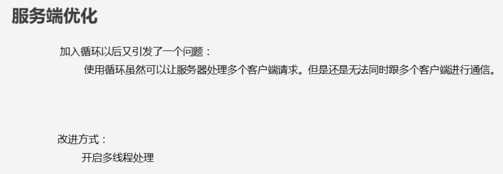
- 使用线程池(plus):
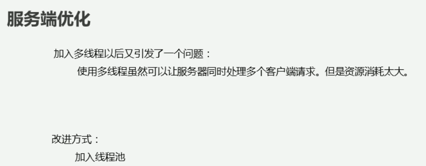
