# 多线程

1. 并发:在同一时刻，有多个指令在单个CPU上**交替**执行
2. 并行:在同一时刻，有多个指令在多个CPU上**同时**执行。

*进程与线程*

### 多线程的实现方案
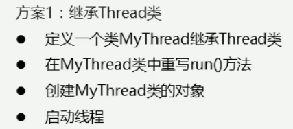
*继承Thread类*

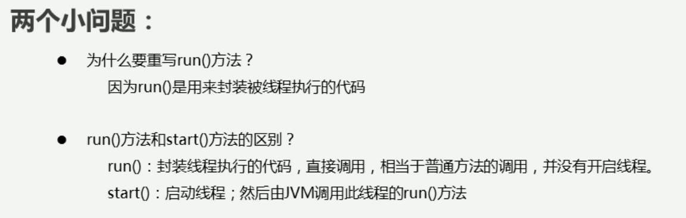

*第三种实现方式*

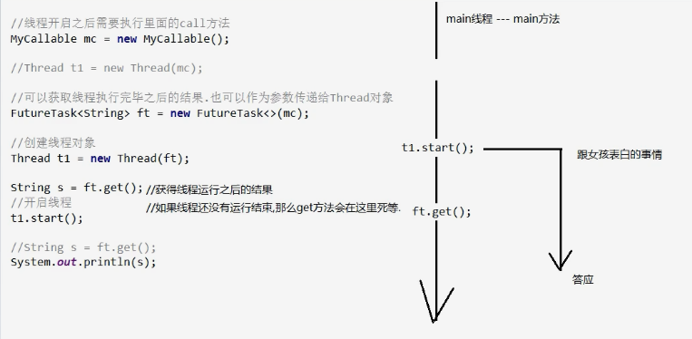
*注意事项*

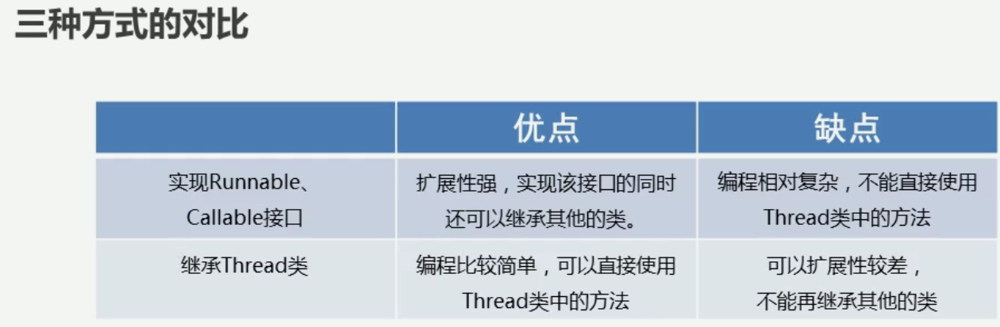
*三种方式优劣对比*

### 部分方法说明
  | 方法名                            | 说明                       |
  | ------------------------------ | ------------------------ |
  | static void sleep(long millis) | 使当前正在执行的线程停留（暂停执行）指定的毫秒数 |

trip: 
注意点：如果一个类、接口的方法中没有抛出异常，那么它的子类或者实现类重写的方法就不能抛出异常,必须自己try catch

## 多线程安全问题
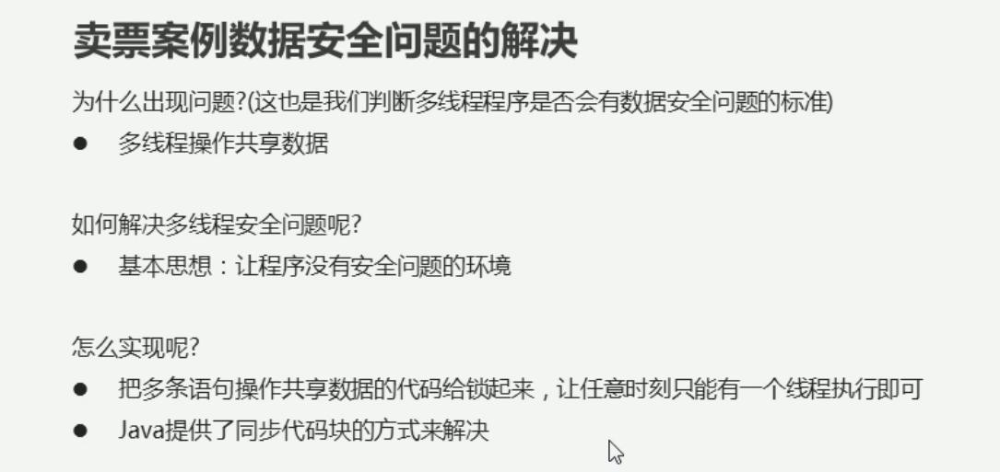
*案例分析*

解决方案：
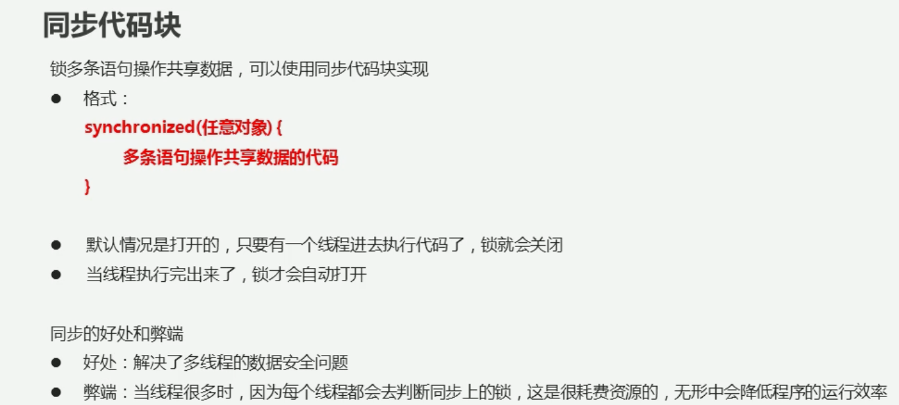
*同步代码块*

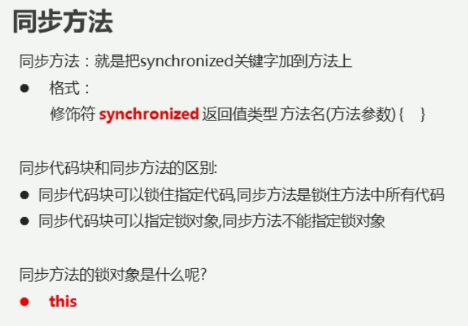
*同步方法*

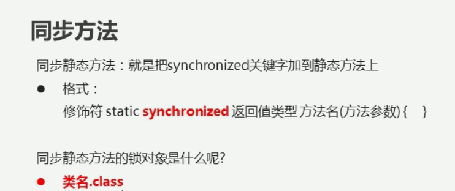
*静态同步方法*

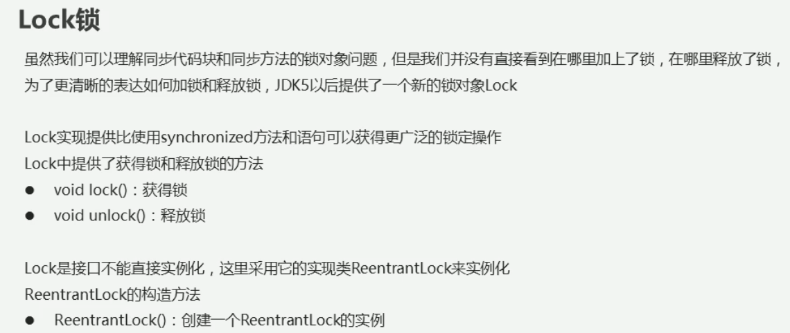
*Lock锁*

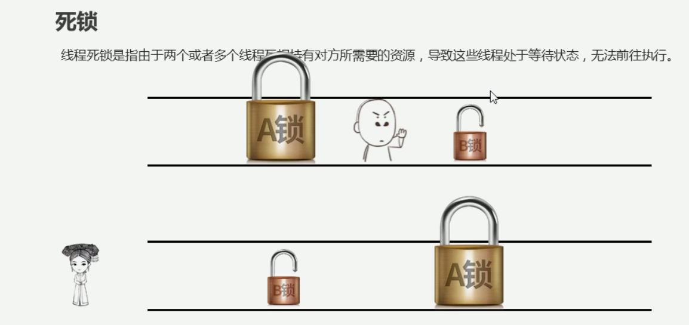
*死锁产生情况,生动形象*
解决方法：简单直接，不要写锁的嵌套即可

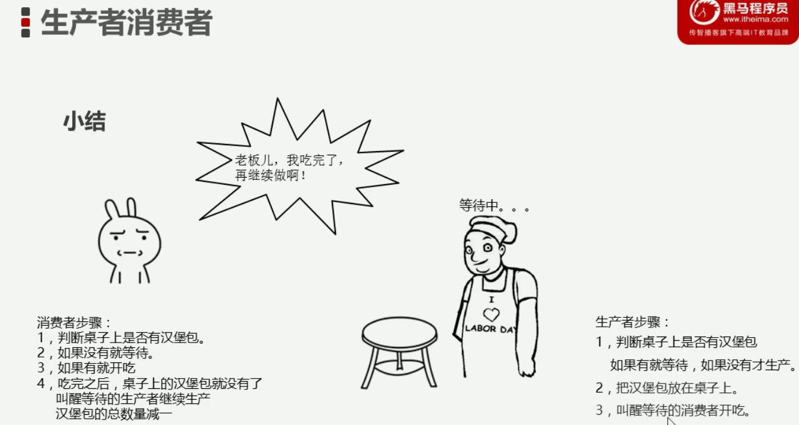
*生产者与消费者*

## 线程学习进阶 高级

*线程状态概括及可能的意外情况*

## 线程池
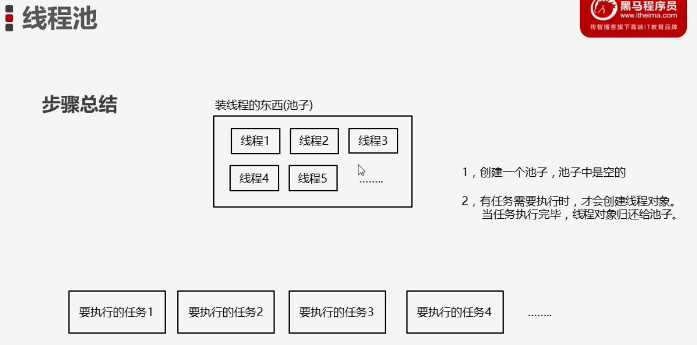

### ThreadpoolExecutor:

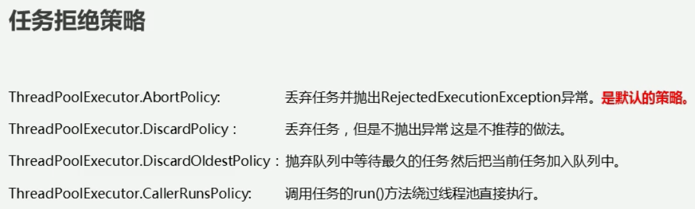

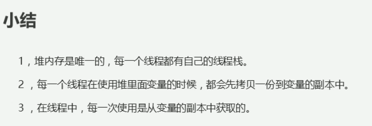

解决多线程数据不共享的方法:
- Volatile关键字:强制线程在每次使用的时候，都会看一下共享区域最新的值
- 法二：synchronized同步代码块
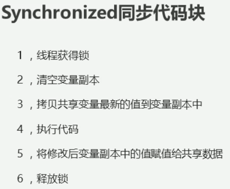

原子性:

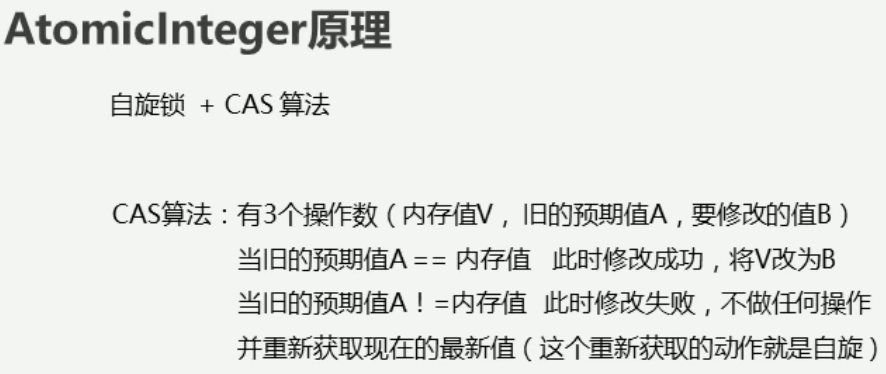

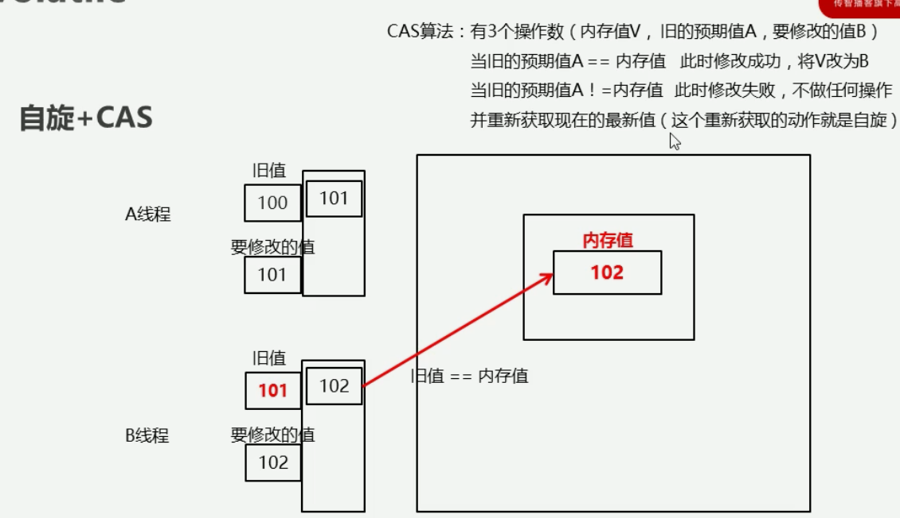
**实现原理**

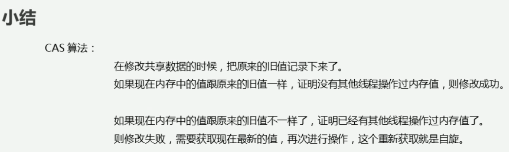
**总结**

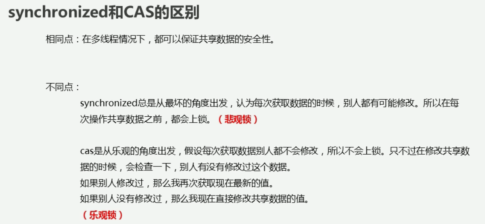
**横向对比**

并发工具类:
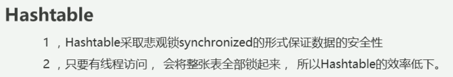

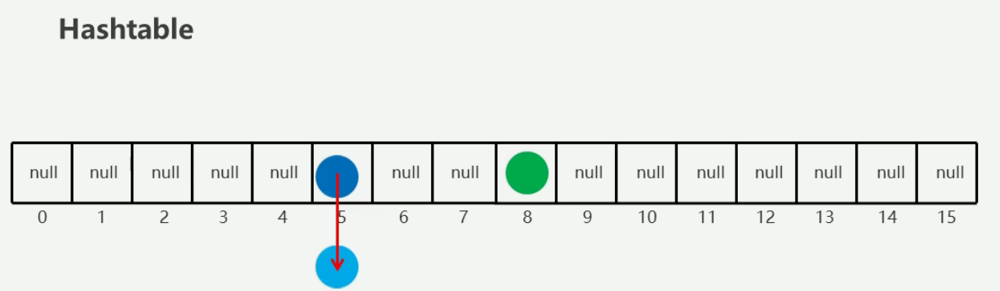
hash值计算冲突，但是equal比较方法不相等，说明内容不同，所以形成hash桶结构，链地址法

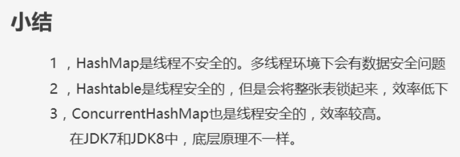

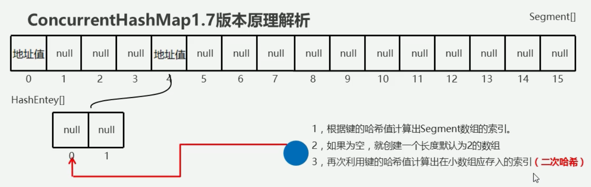
- 地址值:每个数组位置对应的小数组的地址

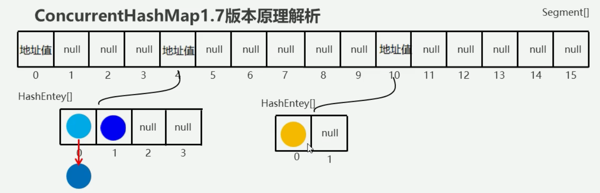
JDK1.7插入方法: 大的数组不能扩容，小的数组可以扩容，每次扩容二倍

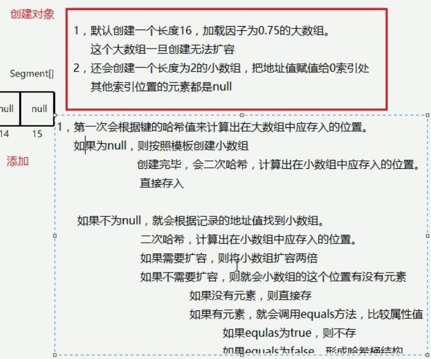
*文字说明*

jdk1.8：
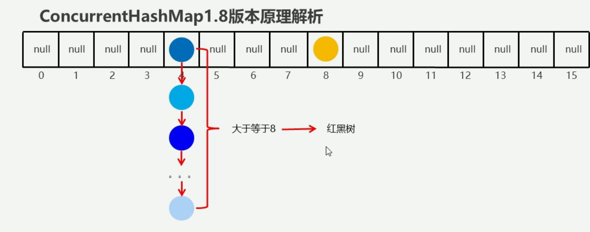

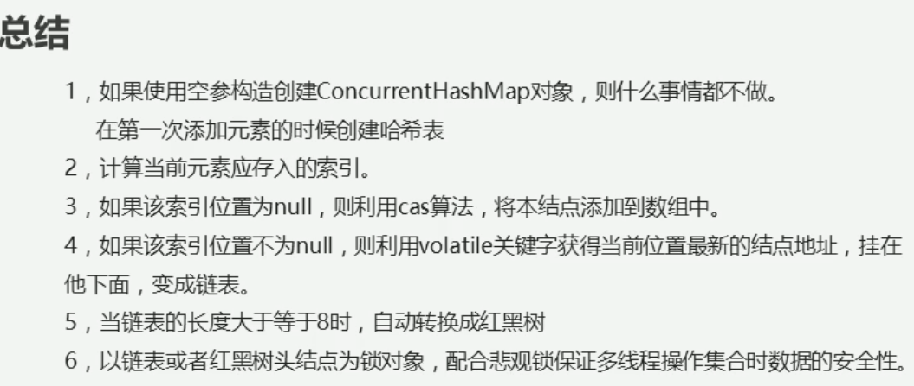
*ConcurrentHashMap1.8版本原理总结*

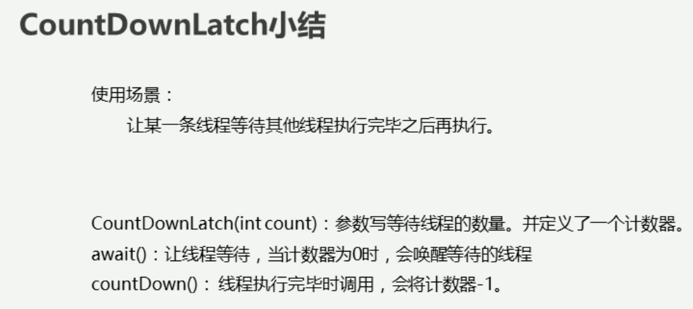
*CountDownLatch总结*

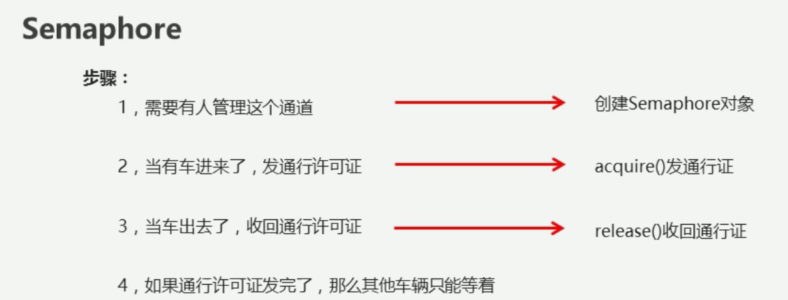
*Semaphore总结*